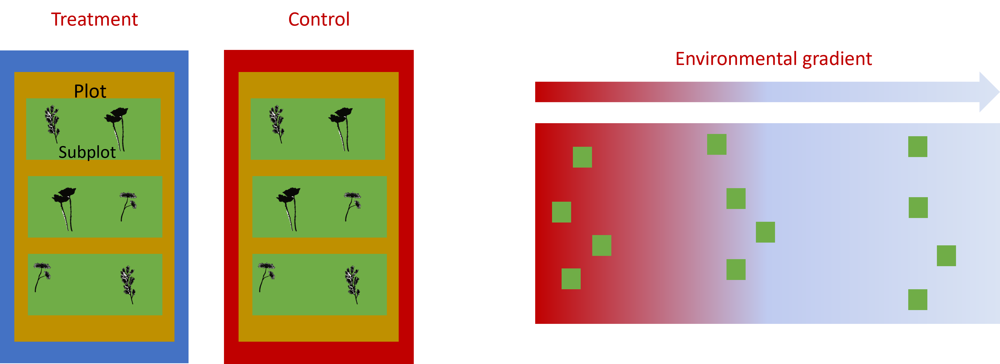
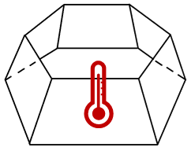
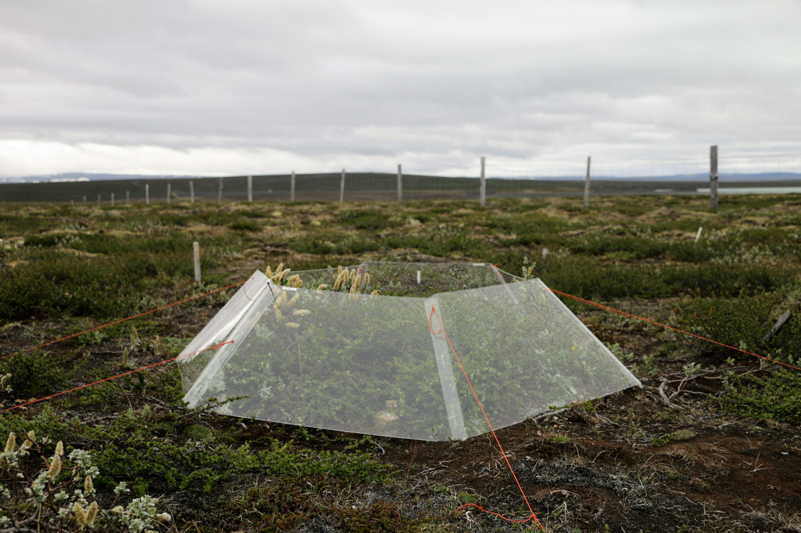

## Today

-   Linear Models
-   Short break 😊
-   What are hierarchical linear models
-   Learn how to build and interpret linear mixed models
-   Break 😊
-   Practice

::: fragment

:::

## Required Material

https://github.com/lacapary/BIO503/

## Required Material

You are required to have downloaded and installed

```{r}
#| output: false
#| eval: false
#| echo: true

install.packages(c("lme4",
                      "ggeffects",
                      "MuMIn",
                      "emmeans"
                      ))
```

## Required Material

::: v-center-container
<h4>Do not hesitate to ask questions!</h4>
:::

## Data for this part of the session

```{r, echo=FALSE, out.width="80%"}
knitr::include_graphics("https://static1.srcdn.com/wordpress/wp-content/uploads/2022/08/Illustrations-of-various-dragons-from-Dungeons-and-Dragons.jpg")
```

[Coding Club Mixed models](https://ourcodingclub.github.io/tutorials/mixed-models/)

Used to build intuition for linear models and mixed models.


# Linear Models

## What is a linear model?

In ecology, we often want to ask:

-   Does temperature drive species richness?
-   Does soil nitrogen limit plant biomass?
-   Does drought reduce tree growth?

::: fragment
A **linear model** is our tool for quantifying these relationships formally. It describes how a *response variable* (what we measure) changes as a predictable function of one or more *predictors* (drivers, treatments, environmental gradients), while accounting for unexplained noise in the system.
:::

## What is a linear model?

In its simplest form:

$$Y = \beta_0 + \beta_1 X + \varepsilon$$

-   $Y$ = the biological response you measure (e.g., plant biomass)
-   $X$ = the driver or predictor (e.g., soil nitrogen)
-   $\beta_0$ = baseline value when $X = 0$ (intercept)
-   $\beta_1$ = how much $Y$ changes per unit of $X$ (the effect size)
-   $\varepsilon$ = everything else: noise, unmeasured factors, natural variation

## Why do we use linear models?

Ecological systems are *complex*, but linear models give us a *simplified* framework to ask and answer key ecological questions.

-   ✅ Simple and interpretable: Easy to understand and communicate.
-   ✅ Flexible: Can be extended with multiple predictors, interactions, etc.
-   ✅ Hypothesis testing: Test relationships grounded in ecological theory.
-   ✅ Data-driven: Connect real-world measurements to ecological mechanisms.
-   ✅ Foundation for advanced models: GLMs, mixed models, and beyond.

## Linear Models

A simple example:

Does soil nitrogen content influence plant productivity?

<p style="font-size: 1.2em;">

[Plant biomass]{style="color: red; font-weight: bold;"} = β₀ + β₁ · Soil nitrogen + ε

</p>

## Linear Models

A simple example:

Does soil nitrogen content influence plant productivity?

<p style="font-size: 1.2em;">

Plant biomass = β₀ + β₁ · [Soil nitrogen]{style="color: red; font-weight: bold;"} + ε

</p>

## Linear models

```{r, echo = FALSE, message = FALSE}
n <- 100
soil_nitrogen <- rnorm(n, mean = 10, sd = 3)
beta_0 <- 5
beta_1 <- 2
epsilon <- rnorm(n, mean = 0, sd = 1)
plant_biomass <- beta_0 + beta_1 * soil_nitrogen + epsilon

data <- data.frame(SoilNitrogen = soil_nitrogen, PlantBiomass = plant_biomass)

model <- lm(PlantBiomass ~ SoilNitrogen, data = data)

intercept <- coef(model)[1]
slope <- coef(model)[2]

equation <- paste("y = ", round(intercept, 2), " + ", round(slope, 2), "x", sep = "")

library(ggplot2)

ggplot(data, aes(x = SoilNitrogen, y = PlantBiomass)) +
  geom_point(color = "#374558", size = 2) +
  geom_smooth(method = "lm", color = "#A7B5C8", se = FALSE, linewidth = 1.5) +
  labs(title = "Relationship between Soil Nitrogen and Plant Biomass",
       x = "Soil Nitrogen",
       y = "Plant Biomass") +
  theme_classic() +
  annotate("text", x = 3, y = 35, label = equation, color = "black", size = 7, hjust = 0)


```

---

# Linear Models: 
Dragon Example
---

## Explore the data

```{r}
#| output: true
#| eval: true
#| echo: true
library(tidyverse)
load("CC-Linear-mixed-models/dragons.RData")

dragons_Bavarian <- dragons |>
  filter(mountainRange == "Bavarian")

```

## Explore the data

```{r, echo = TRUE}
head(dragons_Bavarian)
```

## Explore the data

```{r, echo = TRUE}
hist(dragons_Bavarian$testScore)
```

## Our question

How does body size of dragons influence their intelligence?

## Our question

How does body size of dragons influence their intelligence?

First we will plot our DAG:

```{r, echo = FALSE, message = FALSE}
#| message: false
library(ggdag)
library(tidyverse)

# Define a DAG
dag_data <- dagify(
  IQ ~ Size,
  exposure = "Size",
  outcome = "IQ",
  labels = c(
    Size = "Dragon body length",
    IQ = "IQ - Test score"
  )
)

ggdag_parents(dag_data, .var = "IQ",text = FALSE,use_labels = "label") +
  theme_dag() +
  scale_fill_manual(values = c("#c0392b","#a569bd"))+
  scale_color_manual(values = c("#a569bd","#c0392b"))+
  theme(legend.position ="none")
```

## Our question

How does body size of dragons influence their intelligence?

Then our model:

<p style="font-size: 1.2em;">

Test score = β₀ + β₁ · Body length + ε

</p>

## Our question

Now lets visualize the relationship using ggplot.

```{r echo=TRUE}
p <- dragons_Bavarian %>%
  ggplot(aes(
    x = bodyLength,
    y = testScore)) +
  geom_point() +
  stat_smooth(method = "lm") +
  theme_classic() +
  labs(
    x = "Body length",
    y = "Test score")

```

## Our question

Now lets visualize the relationship using ggplot.

```{r echo=FALSE}
(p <- dragons_Bavarian %>%
  ggplot(aes(
    x = bodyLength,
    y = testScore)) +
  geom_point() +
  stat_smooth(method = "lm") +
  theme_classic() +
  labs(
    x = "Body length",
    y = "Test score")
)
```

## Lets model it

```{r, echo = TRUE}

basic.lm <- lm(testScore ~ bodyLength, data = dragons_Bavarian)
summary(basic.lm)

```

---

# Factorial ANOVA

---

## Factorial ANOVA: It's Just a Linear Model

-   *Factorial ANOVA* is a special kind of analysis used when you have two or more categorical predictors.

-   But in R, you don't need a special ANOVA function. You can just use the `lm()` function.

-   That's because factorial ANOVA is just a *linear model* with categorical predictors.

## Factorial ANOVA: Example

Using the `iris` data set.

This fits a linear model where Species is treated as a factor.

```{r echo=TRUE}
model <- lm(Sepal.Length ~ Species, data = iris)
summary(model)
```

## Factorial ANOVA: Example

When we run the ANOVA, we're checking if the average sepal length is about the same for all the species, or if at least one species is different from the others.

```{r echo=TRUE}
anova(model)
```

## Factorial ANOVA: Post-Hoc Analysis

-   Let's say we run an ANOVA and find a significant result.

-   The test: "There's a difference somewhere"

-   The post-hoc test: "Who's different from who"

::: fragment
```{r echo=TRUE}
library(emmeans)
# Get estimated marginal means
em <- emmeans(model, ~ Species)

# Pairwise comparisons with Tukey adjustment
pairs(em, adjust = "tukey")
```
:::

## Factorial ANOVA: Post-Hoc Analysis

::: callout-important
Use post-hoc tests only if your ANOVA result is significant.
:::

```{r}
ggplot(iris, aes(x = Species, y = Sepal.Length)) +
  geom_boxplot(fill = "#fc91b8") +
  labs(
    title = "Sepal Length by Species",
    x = "Species",
    y = "Sepal Length"
  ) +
  theme_minimal()
```

---

# Generalised Linear Models

---

## From LM to GLM: what changes?

A standard linear model makes three key assumptions:

-   The response variable is **continuous**.
-   The residuals are **normally distributed**.
-   The variance is **constant** across all fitted values (homoscedasticity).

::: fragment
In ecology, these assumptions are routinely violated:

-   Counting individuals per plot: integers, never negative, often zero-heavy.
-   Presence/absence of a species: binary, bounded between 0 and 1.
-   Percentage cover: proportion, can't exceed 100%.
:::

##
::: fragment
A **Generalised Linear Model (GLM)** relaxes these constraints by letting you choose the distribution that actually fits your data.
:::

## From LM to GLM: the link function

A GLM has three components:

-   **Random component**: the distribution of the response (e.g., Poisson, Binomial).
-   **Systematic component**: the linear predictor, $\beta_0 + \beta_1 X + \ldots$
-   **Link function**: a transformation that connects the linear predictor to the expected value of the response on the correct scale.

## Possible distributions

Choose based on the nature of your response variable:

-   **Gaussian** — continuous, symmetric data; the classic linear model (e.g., plant height, biomass, temperature).
-   **Poisson** — count data; integers, cannot be negative, often zero-heavy (e.g., number of species per plot, insect abundance).
-   **Binomial** — binary or proportion data (e.g., presence/absence, proportion of plots occupied by a species).
-   **Gamma** — continuous, strictly positive, right-skewed (e.g., biomass, precipitation).
-   **Negative Binomial** — count data with overdispersion, when Poisson variance is too small to fit the data.

## Which model to use?

::: {style="background-color:white; display:inline-block; padding: 10px;"}

:::

## Generalised linear models: syntax in R

Syntax for a model with Poisson distribution (count data)

```{r}
#| output: false
#| eval: false
#| echo: true

glm(y ~ x, family = poisson, data = df)

```

Syntax for a model with Binomial distribution (presence/absence, proportions)

```{r}
#| output: false
#| eval: false
#| echo: true

glm(y ~ x, family = binomial, data = df)

```

## BREAK

```{r, echo=FALSE, out.width="100%"}
knitr::include_graphics("https://assets-global.website-files.com/647888ca92d03e3fca3f1ea0/647888ca92d03e3fca3f2376_shutterstock_792140977.jpg")
```

---

# Hierarchical Linear Models

---

## Ecological and biological data can be complex!

-   Hierarchical structure in the data

-   Many covariates and grouping factors

-   Unbalanced study/experimental design

## Hierarchical structures example

```{r, echo=FALSE, out.width="100%"}

```

## What is the Independence Assumption?

In basic statistical models, we assume each observation gives us **new, independent information**.

::: fragment
*What happens in one sample shouldn't depend on what happened in another.*
:::

## Hierarchical structures in ecology

-   Measurements from the **same plot or site** are often more similar.
-   Observations from the **same species** might behave similarly.
-   Samples collected **close in time or space** can be correlated.

::: fragment
### Analogy 💡

> Measuring the same tree's height 3 times isn't the same as measuring 3 different trees.

::: fragment
We call this **dependence** — and we need special models to handle it!
:::
:::

## Diagnosing dependence

Ask yourself:

**Are there clusters in my data?**

Are data points grouped by site, species, individual, or time?

## How could we analyze this data?

A standard linear model treats all observations as independent. But we just established they are not.

::: fragment
If we ignore the grouping structure, we risk:

-   **Pseudoreplication**: treating 10 measurements from the same site as 10 independent data points.
-   **Wrong p-values**: artificially inflating our confidence in the results.
-   **Misleading conclusions**: a pattern that exists only within one site gets presented as a general rule.
:::

## How could we analyze this data?

We need a model that can separate two things at once:

::: fragment
1. The **biological effect we care about** (e.g., does temperature reduce species richness?).
:::

::: fragment
2. The **noise introduced by the grouping structure** (e.g., sites differ from each other for all sorts of reasons we did not measure).
:::

::: fragment
That model is a **Linear Mixed Model**.

It handles both by splitting predictors into two types: **fixed effects** and **random effects**.
:::

## Fixed effects

Fixed effects are the predictors you explicitly want to test and report.

-   Each level gets its own estimated coefficient in the model.
-   They directly answer your research question.
-   You have measured all the levels you care about, and you would report them specifically in your results.

::: fragment
**Ecological examples:** treatment (warmed vs. control), soil nutrient level, land use category, species identity (when comparing specific species is the goal).
:::

## Random effects

Random effects are grouping variables where the specific levels in your study are a sample from a larger population of possible levels.

-   The model does not estimate a separate coefficient for each group.
-   Instead, it estimates how much variability exists across groups, treating each group's effect as a random draw from a shared distribution.
-   You are not asking "what is specific to Site 3?" but rather "how much do sites vary overall, so I can account for it?"

::: fragment
**Ecological examples:** site, plot, individual plant (repeated measures), year, observer.
They are always **categorical**.
:::

## Active break 💡

**Scenario:** You are studying how warming affects plant height in Arctic tundra. You set up open-top chambers (warming treatment) and control plots across **6 sites** spread along a latitudinal gradient. At each site you have 5 warmed plots and 5 control plots, and you measure the height of 10 plants per plot.

**Your research question:** Does warming increase plant height?

::: fragment
Discuss with your neighbour:

1. **What is the fixed effect?** What predictor directly answers your research question?

2. **What is the random effect?** The 6 sites were chosen because they were accessible, not because you care about those specific sites. What does that make them?
:::

---

# Back to the Dragons: 
now with all mountain ranges
---

## Dragon data

```{r}
#| output: false
#| eval: true
#| echo: false
library(tidyverse)
load("CC-Linear-mixed-models/dragons.RData")

dragons<- dragons |>
  mutate(bodyLength2=scale(bodyLength,center = TRUE, scale = TRUE))
```

We went to the field and sampled more mountains with dragons.

```{r}
#| output: true
#| eval: true
#| echo: false
dragons |> group_by(mountainRange,site) |>
  summarise(samples=n())
```

### Research question

::: v-center-container
<h4>Is the test score affected by body length?</h4>
:::

## Dragons: Naive Linear Model

```{r}
#| output: true
#| eval: true
#| echo: true
basic.lm <- lm(testScore ~ bodyLength2, data = dragons)
summary(basic.lm)
```

## Dragons: Naive Linear Model

```{r}
#| output: true
#| eval: true
#| echo: true
(prelim_plot <- ggplot(dragons, aes(x = bodyLength, y = testScore)) +
  geom_point() +
  geom_smooth(method = "lm"))+
  theme_classic()
```

## Assumptions check

```{r}
#| output: true
#| eval: true
#| echo: true
qqnorm(resid(basic.lm)); qqline(resid(basic.lm))
```

## Assumptions check

::: v-center-container
<h4>Are our data independent?</h4>
:::

```{r}
library(ggdag)
dag_data <- dagify(
  testScore ~ bodyLength2 + site,
  site ~ mountainRange,
  exposure = "bodyLength2",
  outcome = "testScore",
  latent = c("site", "mountainRange")
) %>%
  tidy_dagitty()

dag_data <- dag_data %>%
  mutate(label = case_when(
    name == "testScore" ~ "Test Score",
    name == "bodyLength2" ~ "Body Length",
    name == "site" ~ "Site (RE)",
    name == "mountainRange" ~ "Mountain Range (RE)",
    TRUE ~ name
  ))

ggdag_parents(dag_data, .var = "testScore", text = FALSE, use_labels = "label") +
  theme_dag() +
  scale_fill_manual(values = c("#c0392b", "#a569bd")) +
  scale_color_manual(values = c("#a569bd", "#c0392b")) +
  theme(legend.position = "none")
```

-   They are Hierarchical!
-   Our research question:
    -   Does a dragon's body length predict its test score, after accounting for variation across mountain ranges?

## Assumptions check

```{r}
#| output: true
#| eval: true
#| echo: true

(colour_plot <- ggplot(dragons, aes(x = bodyLength, y = testScore, colour = mountainRange)) +
  geom_point(size = 2) +
  theme_classic() +
  theme(legend.position = "none"))
```

## How to implement mixed models in R?

-   Step 1: Model building
-   Step 2: Model validation
-   Step 3: Model interpretation
-   Step 4: Model visualization

## Step 1: Model building

Hierarchical linear models fit a separate regression line for each and every cluster, then estimate what we call the *fixed slope*: the average slope between x and y across all clusters.

## Step 1: Model building Dragons

```{r}
#| output: true
#| eval: true
#| echo: true
#| code-line-numbers: "|1|2|3|4|5"
library(lme4) #"linear mixed model" function from lme4 package
mixed.lmer <- lmer(testScore ~ bodyLength2 +
                     (1|mountainRange/site), #random effect
                   data = dragons,
                   REML = TRUE #estimation method other method ML but it has a bias
                   )
```

## Step 2: Model validation Dragons

Assumptions check

```{r}
#| output: true
#| eval: true
#| echo: true
qqnorm(resid(mixed.lmer))
qqline(resid(mixed.lmer))
```

## Step 3: Model interpretation Dragons

```{r}
summary(mixed.lmer)

```

```{r}
#| output: true
#| eval: true
#| echo: true
library(MuMIn)
r.squaredGLMM(mixed.lmer)
```

## Step 4. Visualization

```{r}
#| output: true
#| eval: true
#| echo: true
#| code-line-numbers: "1|3-4|6"
library(ggeffects)

# Extract the prediction data frame
pred.mm <- ggpredict(mixed.lmer, terms = c("bodyLength2"))  # this gives overall predictions for the model
head(pred.mm)
```

## Step 4. Visualization

```{r}
#| output: false
#| eval: true
#| echo: true
#| code-line-numbers: "|3-4|5-13|13-17"

# Plot the predictions
p<-ggplot(pred.mm) +
    # slope
    geom_line(aes(x = x, y = predicted)) +
    # error band
    geom_ribbon(
      aes(
        x = x,
        ymin = predicted - std.error,
        ymax = predicted + std.error
      ),
      fill = "lightgrey",
      alpha = 0.5
    ) +
    # adding the raw data (scaled values)
    geom_point(data = dragons,
               aes(x = bodyLength2, y = testScore, colour = mountainRange)) +
    labs(x = "Body Length (indexed)",
         y = "Test Score",
         title = "Body length does not affect intelligence in dragons") +
    theme_minimal()

```

## Step 4. Visualization

```{r}
#| output: true
#| eval: true
#| echo: false
p
```

## Step 4. Visualization

```{r}
#| output: true
#| eval: true
#| echo: true
#| code-line-numbers: "|3|4"
p<-
  ggpredict(mixed.lmer, terms = c("bodyLength2", "mountainRange"),
            type = "random") %>%
   plot(show_ci = FALSE) +
   labs(x = "Body Length", y = "Test Score",
        title = "Effect of body size on intelligence in dragons") +
   theme_minimal()
```

## Step 4. Visualization

```{r}
#| output: true
#| eval: true
#| echo: false
p
```

## Random intercept vs. random slope

**Random intercept** `(1|group)`: each group gets its own baseline, but the effect of the predictor is the same across all groups.

> Some mountain ranges have smarter dragons on average, but body length affects test score equally everywhere.

::: {.fragment .fade-in}
**Random slope** `(1 + x|group)`: each group gets its own baseline **and** its own slope. The effect of the predictor is allowed to differ across groups.

> In some mountain ranges body length predicts intelligence strongly; in others there is almost no relationship.
:::

## Random intercept vs. random slope
**When to use which?**

- Use a random intercept when you expect groups to differ in their average response but not in how they respond to your predictor.

- Use random slopes when you have biological reason to think the effect of your predictor genuinely varies across groups, and when you have enough data per group to estimate it.


## Random intercept vs. random slope: the syntax

The `1` inside the brackets refers to the intercept. Adding a variable alongside it allows that variable's slope to vary too.

```{r}
#| output: false
#| eval: false
#| echo: true

# Random intercept only: groups differ in baseline, same slope everywhere
lmer(y ~ x + (1|group))

# Random intercept + random slope: groups differ in baseline AND in the effect of x
lmer(y ~ x + (1 + x|group))
```

::: fragment
For the dragons: we allow both the baseline test score **and** the effect of body length to vary across mountain ranges and sites.

```{r}
#| output: true
#| eval: true
#| echo: true
#| code-line-numbers: "|2"
mixed.ranslope <- lmer(testScore ~ bodyLength2 +
                         (1 + bodyLength2|mountainRange/site),
                       data = dragons)
```
:::

## Random slopes: what it looks like

Each panel is a mountain range. Each line is a site. Notice lines differ in both starting height (intercept) and steepness (slope).

```{r}
#| output: true
#| eval: true
#| echo: false
(mm_plot <- ggplot(dragons, aes(x = bodyLength, y = testScore, colour = site)) +
      facet_wrap(~mountainRange, nrow=2) +
      geom_point(alpha = 0.5) +
      theme_classic() +
      geom_line(data = cbind(dragons, pred = predict(mixed.ranslope)), aes(y = pred), size = 1) +
      theme(legend.position = "none",
            panel.spacing = unit(2, "lines"))
)
```

## Nested vs. crossed 

So far our random effects have been **nested**: each lower level belongs to exactly one higher level.

> Site 1 in the Bavarian mountains is a different site from Site 1 in the Alps. They share a label but are completely separate. Sites are nested within mountain ranges.

Syntax: `(1|mountainRange/site)`

::: fragment
**Crossed** random effects arise when the same levels of one grouping variable appear across multiple levels of another.

> The same **year** (e.g., 2022) occurs at every site simultaneously. Year is not inside any one site; it crosses all sites.

Syntax: `(1|site) + (1|year)` — two separate parallel terms.
:::

## Crossed effects: a plant example

Greenhouse experiment measuring leaf length under warming vs. control:

-   20 beds, each with 50 seedlings, each with 5 leaves measured: **nested** (Leaf inside Plant inside Bed).
-   The experiment runs across 3 years and 4 seasons: **crossed** — every season occurs in every bed.
-   A very hot summer hits in year 2, affecting all beds equally.

::: fragment
Season cannot go inside the Bed hierarchy because it is not unique to any bed. If you ignore it, the effect of that hot summer inflates your residual variance and distorts the treatment estimate.
:::

## Crossed effects: the syntax

```{r}
library(ggdag)
dag_data <- dagify(
  leafLength ~ treatment + Leaf + Season,
  Leaf ~ Plant,
  Plant ~ Bed,
  exposure = "treatment",
  outcome = "leafLength",
  latent = c("Leaf", "Plant", "Bed", "Season")
) %>%
  tidy_dagitty()

dag_data <- dag_data %>%
  mutate(label = case_when(
    name == "leafLength" ~ "Leaf Length",
    name == "treatment" ~ "Treatment",
    name == "Leaf" ~ "Leaf (RE)",
    name == "Plant" ~ "Plant (RE)",
    name == "Bed" ~ "Bed (RE)",
    name == "Season" ~ "Season (RE)",
    TRUE ~ name
  ))

ggdag_parents(dag_data, .var = "leafLength", text = FALSE, use_labels = "label") +
  theme_dag() +
  scale_fill_manual(values = c("#c0392b", "#a569bd")) +
  scale_color_manual(values = c("#a569bd", "#c0392b")) +
  theme(legend.position = "none")
```

::: fragment
The nested hierarchy uses `/`. The crossed factor gets its own separate `+` term.

```{r}
#| output: false
#| eval: false
#| echo: true

leafLength ~ treatment + (1|Bed/Plant/Leaf) + (1|Season)
```
:::

## Additional resources

Popular libraries for (G)LMMs:

-   Frequentist : `nlme`, `lme4`, `glmmTMB`

-   Bayesian : `brms`, `rstan`, `rstanarm`, `MCMCglmm`

-   Nice visualization : [link](https://mfviz.com/hierarchical-models/)

-   Most of the material comes from : [Coding Club](https://ourcodingclub.github.io/)

## BREAK

```{r, echo=FALSE, out.width="100%"}
knitr::include_graphics("https://assets-global.website-files.com/647888ca92d03e3fca3f1ea0/647888ca92d03e3fca3f2376_shutterstock_792140977.jpg")
```

---

# Exercise

---

## Exercise

Now let's practice ...

::: fragment

:::

## ITEX

We will be using a dataset from the ITEX network.

-   ITEX is a long-term warming experiment that uses standardized protocols to examine impacts of warming on Arctic ecosystems.

-   Established in the 1990s - vegetation monitoring over three decades.

-   Uses a simple method that is easy to establish in the field - open top chambers

::: fragment
```{r, echo=FALSE, out.width="20%"}

```
:::

## ITEX

```{r, echo=FALSE, out.width="100%"}

```

## Let's look at the data

```{r, echo=TRUE}
itex <- read_csv("Data/ITEX_diversity_data.csv")
```

::: fragment
```{r, echo=TRUE}
head(itex)
```
:::

::: fragment
```{r, echo=TRUE}
length(unique(itex$SITE)) #this code tells you how many different samples we have within the SITE column
```
:::

::: fragment
```{r, echo=TRUE}
unique(itex$SITE) #you can also do this and then it gives you the name of all samples within the SITE column
```
:::

## Exercise 1: Modeling the impact of climate change

Using the **ITEX diversity dataset**, think about a research question you could ask regarding the impact of one aspect of climate change on a variable of interest across different sites.

Explore your research question using modeling tools you learned in today's lecture.

## Exercise 1 - Your tasks

👉 Your Tasks:

1.  **Model Planning**:
    -   What is your **response variable**?
    -   Which variables make sense as **fixed effects**?
    -   Which variable(s) should be treated as **random effects** (e.g., site, year)?
2.  **Fit the Model**:
    -   Use `lmer()` to fit a model to the data and look at the output with `summary()`.
3.  **Reflect**:
    -   Does the model structure reflect **how the data was collected**?

## Exercise 2 (optional)

Explore your research question **within sites**, as opposed to across sites as before.

Now that you've explored overall patterns, focus your model on how **climate change impacts your variable of interest, within each site**.

## Exercise 2 (optional) - Your tasks

👉 Your Tasks:

1.

    -   What changes when we ask about relationships *within sites* instead of *across* them?
    -   Should you adjust the way `site` is treated in your model?

2.  **Model Check**:

3.  **Fit a New Model (if needed)**:

    -   Update your `lmer()` call to reflect this new focus.
    -   Reinterpret the output

## What is next

-   28th of April 13:15am -17m *3401 Korallrevet* 

```{r eval=FALSE, echo=FALSE }
renderthis::to_pdf("Hierarchical_Linear_Models.html")
```