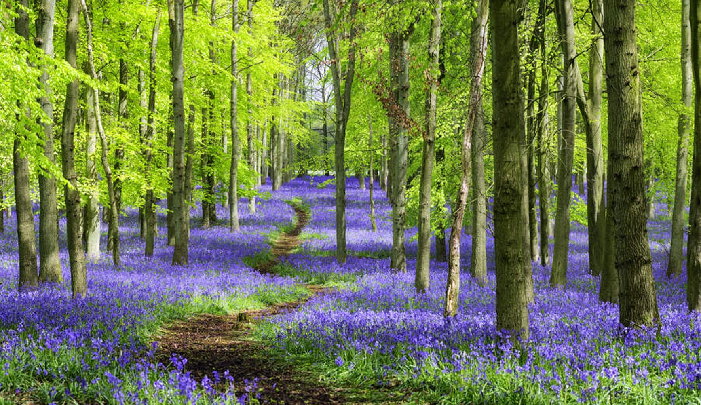
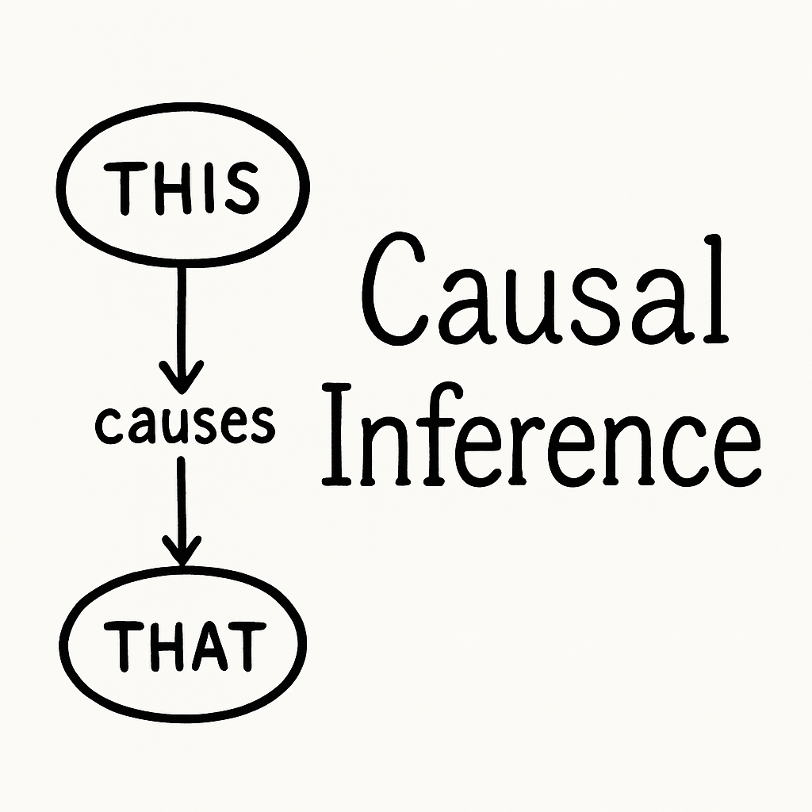
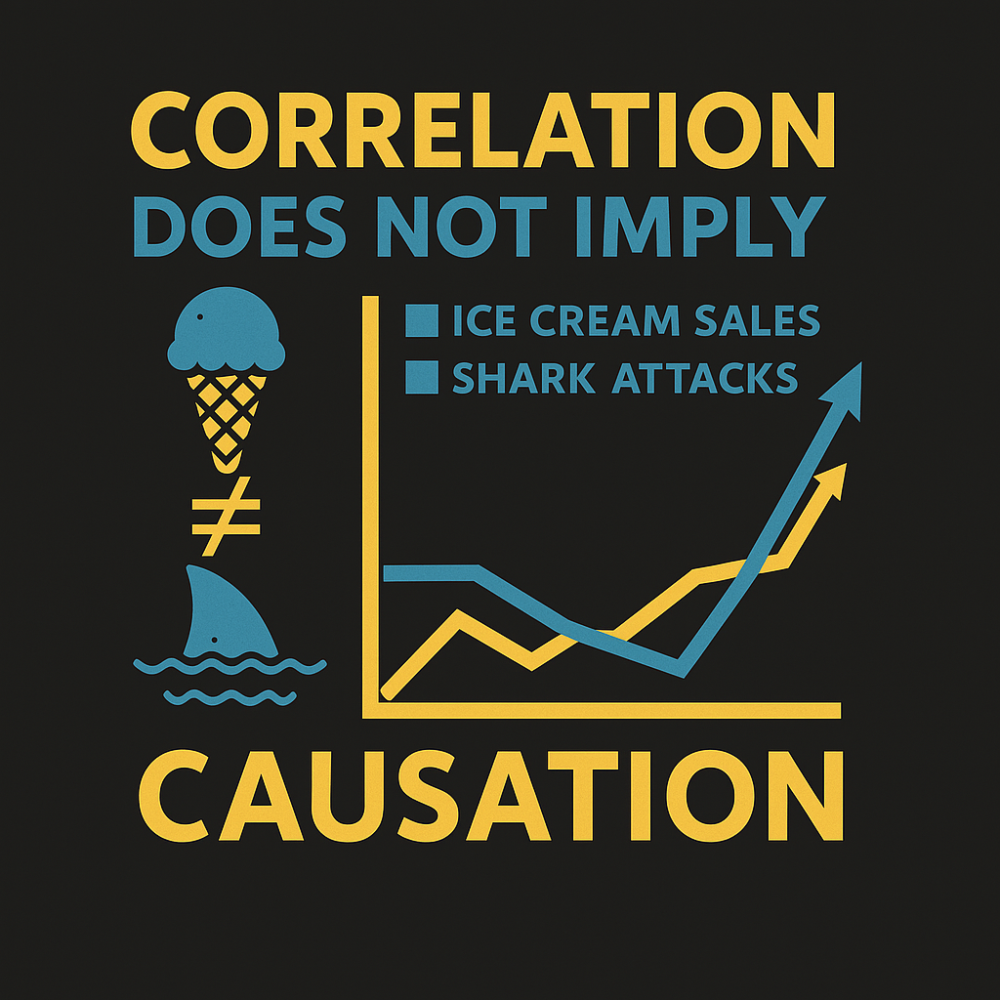
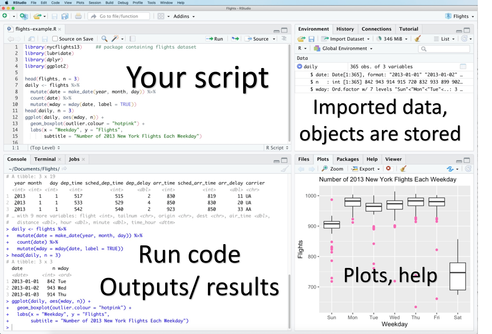
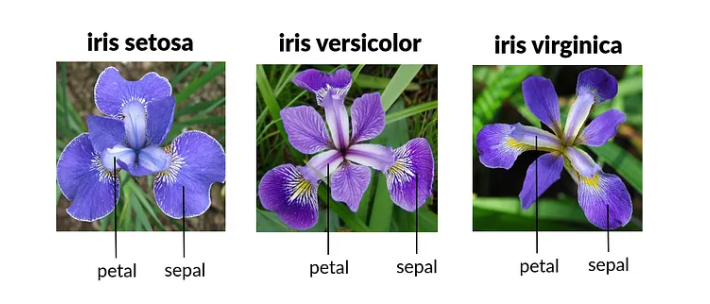

# Welcome!

## Session goals

By the end of this session, you'll be able to:

-   ✅ Explain why ecological systems required multivariate approaches
-   ✅ Distinguish correlation from causation and identify potential confounding
-   ✅ Use R and RStudio to explore ecological data
-   ✅ Create simple plots using `ggplot2`\
-   ✅ Understand the basics of tidy data

## Ecological and biological data can be complex!

-   Generalizing require numerical estimation of difference association.

-   Hierarchical structure in the data

-   Many covariates and grouping factors

-   Unbalanced study/experimental design

## Bluebells

```{r, echo=FALSE, out.width="100%"}

```

## Bluebells

```{r, echo=FALSE, out.width="100%"}

```

# 

::: {style="text-align: center;"}
```{r, echo=FALSE, out.width="60%"}

```
:::

## What is Causal Inference? 🤔

It's the process of determining cause-and-effect relationship.

::: fragment
```{r, echo=FALSE, out.width="30%"}

```
:::

-   Moving beyond **correlation** to understand **causal relationships**
-   Causal inference is about answering questions like: **"Does X cause Y?"**

## Why is This Important in Ecology?

-   Ecological systems are complex
-   Many things can affect each other at the same time
-   We need tools to figure out which relationships are **real causes**, not just coincidences

## A Simple Tool: DAGs

A **DAG** (Directed Acyclic Graph) is a simple diagram to help us think clearly about cause and effect.

-   Circles = variables (things we measure)
-   Arrows = "causes"

::: fragment
```{r, out.width="60%"}
#| message: false
#| fig-align: center
library(tidyverse)
library(ggdag)


# Create the DAG
simple_dag <- dagify(
  y ~ x,
  exposure = "x",
  outcome = "y",
  labels = c("x" = "Exposure", "y" = "Outcome"),
  coords = list(
    x = c(x = 1, y = 2),
    y = c(x = 0, y = 0)
  )
) 

# Plot simple dag
ggdag(simple_dag) +
  theme_dag()
```
:::

## DAG Example

Fragmentation affects pollinators **directly** and **indirectly** (by reducing flowers).

```{r}
#| message: false
library(ggdag)


# Define a DAG
dag_data <- dagify(
  pollinators ~ habitat + flowers,
  flowers ~ habitat,
  exposure = "habitat",
  outcome = "pollinators",
  labels = c(
    habitat = "Habitat fragmentation",
    flowers = "Flowers",
    pollinators = "Pollinator \n Abundance"
  )
)

ggdag_parents(dag_data, .var = "pollinators",text = FALSE,use_labels = "label") +
  theme_dag() +
  scale_fill_manual(values = c("#c0392b","#a569bd"))+
  scale_color_manual(values = c("#a569bd","#c0392b"))+
  labs(title = "DAG: Habitat → Flowers → Pollinators")+
  theme(legend.position ="none")
```

## How DAGs Help

-   They help us ask better research questions
-   They show us what to measure and control for
-   They help us avoid confusing correlation with causation

## What is R and RStudio?

::: columns
::: {.column width="20%"}
{.absolute top="100" left="0" width="128" height="109"}
:::

::: {.column width="80%"}
-   Full-featured programming language for data science
-   Especially powerful in ecological and environmental science 🐛🌍
-   Remember: R is prone to errors!
:::
:::

::: columns
::: {.column width="50%"}
-   RStudio is a user-friendly interface (IDE) for R that makes your work more efficient.

::: callout-tip
Use `Ctrl + Enter` to run code in RStudio
:::
:::

::: {.column width="50%"}
::: fragment
```{r, echo=FALSE, out.width="100%"}
#| echo: False
#| fig-align: center

```
:::
:::
:::

## R studio Projects 📂

-   Keeps your files organized in one place
-   Stores scripts, data, outputs, and more
-   To create a new project:
-   Go to `File` → `New Project…` → `New Directory` (or `Existing Directory`)
-   If using an existing folder: `New Project` → `Existing Directory`

::: fragment
::: callout-tip
Use projects to avoid broken file paths and messy folders!
:::
:::

## Course Material 📘

::: callout-important
<https://github.com/Lacapary/BIO503>
:::

## Coding etiquette

## Use Comments to Organize Your Script & for others!

```{r}
#| echo: true
#Library----

#Some code---- 

#Example----
x <- 9  # Assigning the value to the variable x
```

## R package

-   Package is a collection of R functions, data sets, and other resources bundled together for specific purposes.

-   To install a package, type:

    -   `install.packages("package-name")`

-   **You only need to install packages once**

-   Load the packages, type:

    -   `library(package-name)`

## Example

```{r eval=F, echo=T}
install.packages("dplyr")
library(dplyr)
```

## Intro to `tidyverse` 📦

::: columns
::: {.column width="40%"}
```{r echo=FALSE,out.width="50%", fig.align="center"}
knitr::include_graphics("https://mine-cetinkaya-rundel.github.io/tidy-up-ds/2019-12-lausanne/img/tidyverse.png")
```
:::

::: {.column width="40%"}
```{r echo=FALSE, out.width="100%"}
knitr::include_graphics("https://mine-cetinkaya-rundel.github.io/tidy-up-ds/2019-12-lausanne/img/tidyverse-packages.png")
```
:::
:::

## Pipe operator

-   One of the key features of tidyverse is the possibility to chain functions in an effective way using the pipe operator `%>%` or `|>`.

-   Pipes pass the results from one function directly into the next function connected to each other

-   **The pipe basically means “and then”.**

    ::: fragment
    ::: callout-note
    the keyboard shorcut for `|>` is `Ctrl+Shift+M` (Windows & Linux) or `Cmd+Shift+M` (Mac).
    :::
    :::

## Pipe operator

*First, I'll grab the coffee grounds, then I'll fill up the coffee maker with water, hit the start button, wait for it to brew, and finally pour myself a cup*

```{r eval=F, echo=T}
get("coffee_groundS","23")  |> 
  fill_up("coffee_maker","water")   |> 
  on(start_button)  |> 
  put(cup)
```

## Tidy Data Concept

-   Each variable forms a column
-   Each observation forms a row
-   Each type of observational unit forms a table

::: fragment
```{r, echo=FALSE, out.width="100%"}
knitr::include_graphics("https://biostats-r.github.io/biostats/workingInR/figures/tidy1.png")

```

Source: R for Data Science. Grolemund and Wickham.
:::

## Using the `iris` Dataset

::: columns
::: {.column width="40%"}
-   The iris [flower dataset](https://en.wikipedia.org/wiki/Iris_flower_data_set) was collected by Edgar Anderson, an American botanist, in the 1920s.

-   It includes measurements of 150 flowers across 3 species: *setosa*, *versicolor*, and *virginica*.
:::

::: {.column width="60%"}
```{r, echo=FALSE, out.width="100%"}

```
:::
:::

## Importing data in R

R can import data from files in many different formats.

-   csv files with the `readr` package
-   excel files with the `readxl` package
-   xlm files with the `xml2` package
-   and more...

## Reading data

```{r}
#| eval: true
#| echo: true
#| code-line-numbers: "|1|2"
#| output: false

library(tidyverse)
iris <- read_csv("Data/iris.csv")
```

```{r eval=FALSE, echo=T}
# R basic function
iris <-read.csv("Data/iris.csv")
```

## Exploring the data

Check that your data was imported without any mistakes

```{r echo=T}
head(iris)    # Displays the first rows of a df
tail(iris)  # Displays the last rows of a df
```

## Exploring the data

```{r echo=T}
summary(iris) # Gives you a summary of the data
```

## Manipulating data

```{r, echo=FALSE, out.width="80%"}
knitr::include_graphics("https://www.enzymeinnovation.com/wp-content/uploads/2018/08/person-making-fresh-pizza-dough-by-hand.jpg")
```

## From wide to long

The iris data are organized is "wide" format. Let's transform in "long” format

```{r echo=T}
iris_long <- iris |> pivot_longer( 
                    cols = -Species,
                    names_to = "trait",
                    values_to = "measurement")
head(iris_long)
```

## Group_by and summarize

```{r echo=T}
iris_means <- iris |> 
  group_by(Species) |> 
  summarize(SL_mean = mean(Sepal.Length),
            SL_se = sd(Sepal.Length)/sqrt(n()))

head(iris_means)
```

## Filter - subset rows

```{r echo=T}
iris_versicolor <- iris |>  filter( Species == "versicolor")

iris_pl<-iris |>  filter(Petal.Length > 2)
```

## Select - subset columns

```{r echo=T}
iris_subset<-iris |> select(Species, Petal.Width, Petal.Length)
```

## Mutate

```{r echo=T}
iris_log <-iris |> mutate(log.Sepal.length = log(Sepal.Length))

head(iris_log)
```

## Plotting data

You can plot graphs using the `ggplot2` package (part of the tidyverse).

::: callout-note
`ggplot` functions are chained using a `+`
:::

## ggplot layers

```{r, echo=FALSE, out.width="60%", fig.align="center", fig.cap="Source: https://biostats-r.github.io/"}
knitr::include_graphics("https://biostats-r.github.io/biostats/workingInR/figures/ggplot_setup.png")
```

## Plotting Iris

Lets say we want to plot the relationship between petal length and petal width for each species.

```{r echo=T}
#| output: false
p<-iris %>% 
  ggplot(aes(
    x = Petal.Length,
    y = Petal.Width,
    color = Species # to assign a color to each group
  )) +
  geom_point() + # to plot a scatter plot
  labs(
    x = "Petal length (cm)",
    y = "Petal width (cm)"
  )

```

## Plotting Iris

```{r}
#| echo: False 
p
```

`ggplot` offers many plotting possibilities which we will go further into later. If you are eager, you can learn more [here](https://ggplot2-book.org/) or [here](https://ourcodingclub.github.io/tutorials/datavis/).

## Saving plots

You can save a plot by clicking on the `Export` button in the `Plots` window (bottom right window by default).

Save your plots as `.svg` if your text editor supports it and if you are not limited by file sizes. Otherwise, save your plots as `.png`.

```{r eval=F, echo=T}
p |> ggsave("plot.png")
```

# 💬 Any questions

## To go further

-   Visit: [Coding Club](https://ourcodingclub.github.io/)

-   EDGE coding club: Every 14 days, we have a coding club on Thursdays at 1:00 pm in the 5405 Rosshavet room (Natrium)

## What is next

-   16th of April 13:15am -17m *2122 Iapetus ALC* 
-   Practice using R (self-study)
    -   Reviewing and practicing the material we covered in [today’s lecture](https://github.com/Lacapary/BIO503)
    -   [Linear models](https://ourcodingclub.github.io/tutorials/modelling/)

```{r eval=FALSE, echo=FALSE }
renderthis::to_pdf("Intro_R.html")
```
